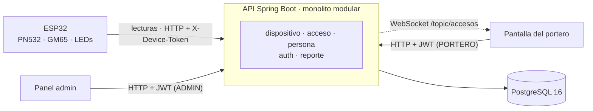
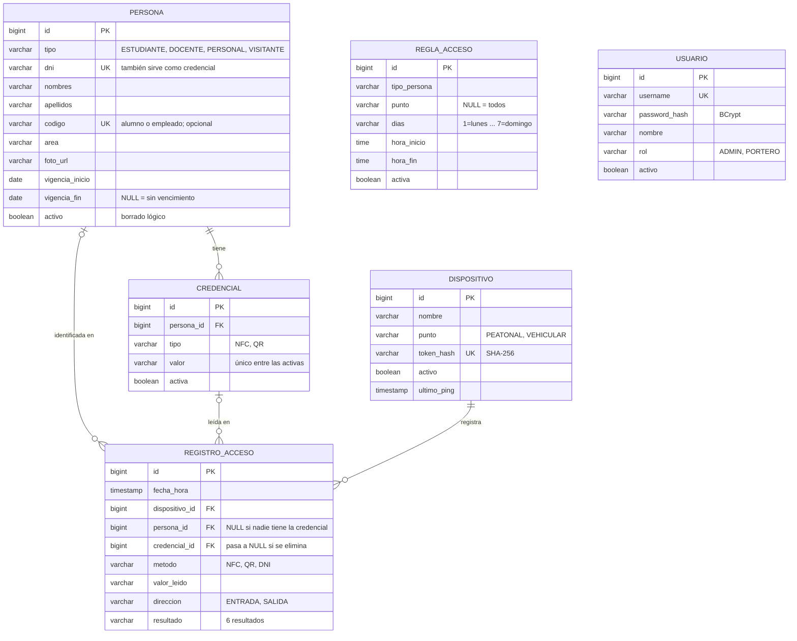
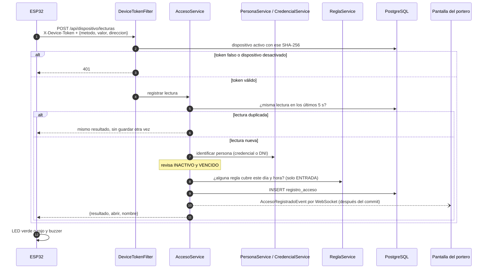

# Diagramas

GitHub dibuja estos diagramas directamente (Mermaid). Para el informe se pueden exportar como imagen desde [mermaid.live](https://mermaid.live) pegando el bloque de código.

## 1. Arquitectura

- El ESP32 se autentica con el token de su dispositivo; las personas (portero y admin), con JWT.
- La pantalla del portero recibe cada acceso al instante por WebSocket, sin recargar.
- Por dentro, la API está dividida en módulos con un dueño cada uno. Sus dependencias están en la guía, sección 4.

## 2. Modelo entidad-relación (V1)

- Las columnas `creado_en` y `actualizado_en` se omiten para que el diagrama se lea mejor.
- `regla_acceso` no tiene claves foráneas: se aplica por `tipo_persona` y `punto`.
- `usuario` son las cuentas del sistema (porteros y admins), no las personas que pasan por la puerta.
- El detalle y el porqué de cada columna están en [decisiones-fase0.md](decisiones-fase0.md) §4.

## 3. Una lectura, del sticker al LED

1. El filtro identifica al dispositivo por el hash de su token; el token nunca se guarda en claro.
2. Una lectura repetida en menos de 5 s (sticker apoyado) devuelve el resultado anterior sin crear otro registro, salvo la segunda entrada tras una entrada autorizada: se registra una alerta `ENTRADA_REPETIDA` y no se abre. Sus rebotes posteriores sí se filtran.
3. Los resultados posibles y su orden de evaluación están en [decisiones-fase0.md](decisiones-fase0.md) §2 y §3.
4. El evento al WebSocket sale **después** del commit: la pantalla nunca muestra un acceso que no quedó guardado.
5. El ESP32 solo mira `abrir`. Si la API no responde en 3 s, prende el LED ámbar.
