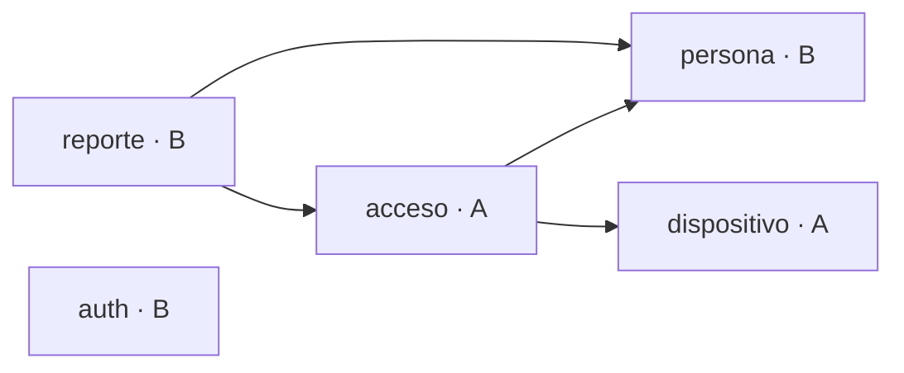

# Guía de desarrollo en equipo — API de Portería (Spring Boot)

Oct 1, 2026 · @Dino

**v2 (1 oct 2026):** revisada al iniciar la Fase 0. La sección 15 resume qué cambió respecto a la v1. Las decisiones de diseño concretas (columnas, resultados, contrato con el ESP32) están en `docs/decisiones-fase0.md`.

## 1. Introducción

Esta guía define cómo dos desarrolladores construyen la API de portería en Spring Boot, por fases, sin pisarse el código y con Git ordenado.

El sistema identifica en portería a estudiantes, docentes, personal y visitantes mediante sticker NFC, código QR o DNI. Un circuito ESP32 lee la credencial y la envía a la API. La API valida, registra el acceso, responde al circuito y actualiza en tiempo real la pantalla del portero. El administrador consulta el historial y gestiona personas, credenciales, dispositivos, usuarios y reglas.

**Cómo usar este documento:**

- Léanlo completo una vez, juntos, antes de escribir código.
- Las fases se hacen en orden. Dentro de cada fase, las tareas de Dev A y Dev B van en paralelo.
- Cada tarea tiene su rama de Git y su issue en GitHub. Marquen las casillas a medida que terminen.
- Si una regla de esta guía estorba, cámbienla aquí mismo, para que ambos trabajen con la misma versión.

**Fuera de alcance de esta guía:** el frontend (vista del portero y panel admin) y el firmware del ESP32 en detalle. Ambos consumen esta API y se construyen después de la Fase 1.

## 2. Equipo y propiedad de módulos

Cada desarrollador es dueño de módulos completos. Ser dueño significa que escribe ese código y aprueba cualquier cambio que el otro proponga ahí.

| Rol | Responsable | Módulos | Archivos en `shared/` | Además |
| --- | --- | --- | --- | --- |
| Dev A — flujo de acceso | David (@David-Quispe) | `dispositivo`, `acceso` | `config/WebSocketConfig` | Integración con el ESP32, firmware, colección Postman del dispositivo |
| Dev B — gestión y seguridad | @degznn | `auth`, `persona`, `reporte` | `security/SecurityConfig` | Colección Postman de admin, datos de prueba |
| Ambos | — | — | `exception/`, `dto/`, `config/OpenApiConfig` | `pom.xml`, `application*.yml`, `README.md` |

**Reglas de propiedad:**

- Si necesitas cambiar un archivo del otro, avísale por el chat del grupo y hazlo en un Pull Request que él revise.
- `SecurityConfig` es el único punto de choque frecuente. Su dueño es Dev B. Dev A pide ahí el registro de su filtro de dispositivo y las rutas `/api/dispositivo/**` y `/ws/**`.
- Los filtros viven en el módulo que los necesita: `DeviceTokenFilter` en `dispositivo/security/` (Dev A) y `JwtService`/`JwtFilter` en `auth/security/` (Dev B). Así `shared` no depende de los módulos; `SecurityConfig` solo los ensambla.
- Los archivos de "Ambos" se cambian en ramas cortas y se fusionan el mismo día, para que el otro no trabaje con una versión vieja.

GitHub puede aplicar esto solo con un archivo `.github/CODEOWNERS`: pide automáticamente la revisión del dueño cuando un PR toca su carpeta. No activen *Require review from Code Owners*: con dos personas, un PR del propio dueño quedaría bloqueado. Basta con la aprobación normal.

```
# .github/CODEOWNERS
/src/**/porteria/dispositivo/                          @David-Quispe
/src/**/porteria/acceso/                               @David-Quispe
/src/main/java/pe/tecsup/porteria/shared/config/WebSocketConfig.java  @David-Quispe
/firmware/                                             @David-Quispe
/src/**/porteria/auth/                                 @degznn
/src/**/porteria/persona/                              @degznn
/src/**/porteria/reporte/                              @degznn
/src/main/java/pe/tecsup/porteria/shared/security/     @degznn
/src/main/resources/db/dev/                            @degznn
```

## 3. Preparación del entorno

Los dos deben tener exactamente las mismas versiones. La mayoría de errores raros en equipo vienen de entornos distintos.

| Herramienta | Versión | Para qué |
| --- | --- | --- |
| JDK Temurin | 21 o 25 (LTS) | Compilar y ejecutar; habilita hilos virtuales. El código apunta a Java 21 (`<java.version>21</java.version>`), así que da igual cuál de los dos tenga cada uno |
| IntelliJ IDEA Community | Última | IDE; trae Maven y soporte de Spring |
| Git | 2.40 o superior | Control de versiones |
| Docker Desktop | Última | Levantar PostgreSQL igual en ambas máquinas |
| Postman | Última | Probar la API y simular al ESP32 |
| DBeaver (opcional) | Última | Ver las tablas de la base de datos |

**Configuración que cada uno hace una sola vez:**

- [ ] Configurar la identidad de Git: `git config --global user.name "Nombre Apellido"` y `git config --global user.email "correo@tecsup.edu.pe"`.
- [ ] Crear una llave SSH y agregarla a GitHub (Settings → SSH and GPG keys), para no escribir contraseña en cada push.
- [ ] Saltos de línea: no hace falta tocar `core.autocrlf`. El `.gitattributes` del repo fuerza LF para todos, así no hay conflictos falsos.
- [ ] En IntelliJ: activar *Enable annotation processing* (Settings → Build → Compiler → Annotation Processors). Sin esto, Lombok y MapStruct no compilan.
- [ ] En IntelliJ: activar *Reformat code* y *Optimize imports* al guardar (Settings → Tools → Actions on Save).
- [ ] Verificar con `java -version`, `git --version` y `docker --version` que todo responde.

El repositorio incluirá un `.editorconfig` (indentación de 4 espacios, UTF-8, salto de línea final). IntelliJ lo respeta solo, así el formato de ambos sale idéntico y los diffs muestran solo cambios reales. Junto con `.gitattributes`, los saltos de línea también son iguales en Windows, Mac y Linux.

## 4. Arquitectura y estructura del proyecto

La API es un **monolito modular**: un solo programa dividido en módulos por funcionalidad, cada uno con un dueño. Esto permite trabajar en paralelo casi sin conflictos de Git, y deja la puerta abierta para separar un módulo como microservicio si algún día lo necesita.



La flecha significa "usa a". Todos los módulos usan `shared`; `auth` es independiente (`SecurityConfig` lo conecta con el resto).

`acceso` es el corazón del sistema: usa los datos de `persona` y `dispositivo`, y `reporte` lee lo que `acceso` registra. Por eso B1 (entidades de persona) es la primera tarea que se fusiona en la Fase 1.

### 4.1 Árbol de carpetas

```
porteria-api/
├── .github/
│   ├── CODEOWNERS
│   ├── pull_request_template.md
│   ├── ISSUE_TEMPLATE/tarea.md
│   └── workflows/ci.yml              (D1, adelantado a la Fase 1)
├── firmware/esp32-porteria/          (PlatformIO, Fase 2)
├── postman/                          (colección compartida)
├── docs/                             (esta guía y decisiones-fase0.md)
├── docker-compose.yml
├── .env.example
├── .editorconfig
├── .gitattributes
├── pom.xml
├── README.md
└── src/
    ├── main/
    │   ├── java/pe/tecsup/porteria/
    │   │   ├── PorteriaApplication.java
    │   │   ├── shared/
    │   │   │   ├── config/           (OpenApiConfig, WebSocketConfig)
    │   │   │   ├── security/         (SecurityConfig: ensambla los filtros)
    │   │   │   ├── exception/        (ApiError, GlobalExceptionHandler, excepciones)
    │   │   │   └── dto/              (PageResponse)
    │   │   ├── auth/                 (+ security/: JwtService, JwtFilter)
    │   │   ├── persona/
    │   │   ├── dispositivo/          (+ security/: DeviceTokenFilter)
    │   │   ├── acceso/               (+ event/)
    │   │   └── reporte/
    │   └── resources/
    │       ├── application.yml
    │       ├── application-dev.yml
    │       ├── application-prod.yml
    │       ├── static/test-ws.html   (Fase 2)
    │       └── db/
    │           ├── migration/        (esquema, para todos los perfiles)
    │           └── dev/              (datos de prueba, solo perfil dev)
    └── test/java/pe/tecsup/porteria/ (misma estructura de módulos)
```

### 4.2 Capas dentro de cada módulo

Cada módulo repite las mismas carpetas. Así, quien abre un módulo ajeno ya sabe dónde está cada cosa.

| Carpeta | Responsabilidad | Ejemplo en `persona` |
| --- | --- | --- |
| `controller/` | Recibe HTTP, valida y responde. Sin lógica | `PersonaController` |
| `service/` | Reglas de negocio y transacciones | `PersonaService` |
| `repository/` | Consultas a la base de datos | `PersonaRepository` |
| `entity/` | Tablas JPA y enums del módulo | `Persona`, `TipoPersona` |
| `dto/` | Lo que entra y sale por la API | `PersonaRequest`, `PersonaResponse` |
| `mapper/` | Conversión entidad ↔ DTO con MapStruct | `PersonaMapper` |

### 4.3 Reglas de dependencia

- El flujo siempre es `controller` → `service` → `repository`. Un controlador nunca llama a un repositorio.
- Un módulo usa a otro **solo a través de su servicio**, nunca de su repositorio. Ejemplo: `acceso` llama a `PersonaService`, no a `PersonaRepository`.
- `shared` no depende de ningún módulo; todos los módulos pueden usar `shared`. Única excepción: `SecurityConfig`, que ensambla los filtros de `auth` y `dispositivo`.
- Excepción de lectura: `reporte` puede usar `RegistroAccesoRepository` solo para consultas (Specifications). Crear registros es exclusivo de `AccesoService`.
- Las dependencias van en una sola dirección, como en el diagrama. Si dos módulos se necesitan mutuamente, es señal de que algo está en el lugar equivocado.

## 5. Flujo de trabajo con Git

Usamos tres niveles de ramas: `main` para lo entregable, `develop` para integrar, y una rama corta por cada tarea. Nadie hace push directo a `main` ni a `develop`.

### 5.1 Ramas

| Rama | Qué contiene | Quién escribe | Cómo entra el código |
| --- | --- | --- | --- |
| `main` | Versión estable, la que se presenta | Nadie directamente | PR desde `develop` al cerrar cada fase, con etiqueta `v0.1.0`, `v0.2.0`… |
| `develop` | Integración del trabajo de ambos | Nadie directamente | PR desde ramas de tarea, con 1 aprobación |
| `feature/<modulo>-<tarea>` | Una funcionalidad nueva | Su dueño | Se crea desde `develop` |
| `fix/<modulo>-<error>` | Corrección de un error | Quien lo encuentra | Se crea desde `develop` |
| `chore/<tarea>` | Configuración, dependencias, documentación | Cualquiera | Se crea desde `develop` |

Ejemplos de nombres: `feature/acceso-lecturas`, `feature/auth-login-jwt`, `fix/persona-paginacion`, `chore/docker-compose`. Siempre en minúsculas, con guiones y sin tildes.

**Reglas de ramas:**

- Una rama = una tarea = un issue. Si la tarea crece, se parte en dos issues.
- Una rama vive entre 1 y 3 días. Las ramas largas acumulan conflictos.
- Cada mañana, antes de programar, actualiza tu rama con `develop` (sección 14).
- Después del merge, la rama se borra en GitHub y en local.

### 5.2 Commits

Usamos el formato *Conventional Commits*, con el módulo entre paréntesis. Así el historial se lee como una bitácora.

| Prefijo | Cuándo | Ejemplo |
| --- | --- | --- |
| `feat` | Funcionalidad nueva | `feat(acceso): procesa lecturas NFC y responde estado` |
| `fix` | Corrige un error | `fix(persona): evita duplicar DNI al editar` |
| `refactor` | Cambia código sin cambiar comportamiento | `refactor(auth): extrae generación de JWT a JwtService` |
| `test` | Agrega o corrige pruebas | `test(acceso): cubre credencial vencida` |
| `docs` | Documentación | `docs: agrega pasos de instalación al README` |
| `chore` | Configuración y dependencias | `chore: agrega MapStruct al pom` |
| `db` | Migraciones Flyway | `db(acceso): agrega índice a registro_acceso.fecha_hora` |

Un commit hace una sola cosa y compila. Mejor cinco commits pequeños que uno llamado "avances".

### 5.3 Pull Requests

1. Al terminar la tarea, sube la rama y abre un PR hacia `develop`.
2. En la descripción escribe `Closes #<número del issue>`: el issue se cierra solo al fusionar.
3. Completa la plantilla del PR (sección 12) y asigna al otro como revisor.
4. El revisor responde en menos de 24 horas: aprueba, o comenta lo que hay que cambiar.
5. El autor corrige en la misma rama; el PR se actualiza solo.
6. Con la aprobación y las pruebas en verde, el **autor** fusiona con *Squash and merge*: todos sus commits quedan como uno solo en `develop`. Esto es solo para ramas de tarea: el PR `develop` → `main` va con *Create a merge commit* (sección 5.5).
7. Borra la rama.

Un PR debería tener menos de 400 líneas cambiadas. Si pasa de eso, la tarea era demasiado grande.

### 5.4 Protección de ramas en GitHub

Primero, en Settings → General:

- [ ] Poner `develop` como **Default branch**. Si no, `Closes #N` no cierra el issue al fusionar en `develop` (GitHub solo lo hace en la rama por defecto) y los PR apuntan a `main` por defecto.
- [ ] Dejar habilitados *Allow squash merging* y *Allow merge commits*.

La protección de ramas en un repositorio **privado** requiere GitHub Pro, que es gratis con el GitHub Student Developer Pack. En un repo público es gratis.

Luego, en Settings → Branches → Add rule, para `main` y para `develop`:

- [ ] *Require a pull request before merging*, con 1 aprobación.
- [ ] *Require status checks to pass* con los checks `api` y `firmware` de `.github/workflows/ci.yml`. Se marca cuando el CI ya esté en `develop`; antes no hay checks que elegir.
- [ ] *Require conversation resolution* (todos los comentarios resueltos).
- [ ] Desactivar *Allow force pushes* y *Allow deletions*.
- [ ] **No** marcar *Require review from Code Owners* (ver sección 2).

### 5.5 Al cerrar cada fase

Cuando todas las tareas de la fase están en `develop` y funcionan juntas, se abre un PR de `develop` a `main` y se fusiona con *Create a merge commit*, nunca con squash: si se aplasta, las dos ramas se separan y el siguiente PR arrastra commits viejos y conflictos. Tras fusionarlo, se crea una etiqueta con la versión (`git tag -a v0.1.0 -m "Fase 1"` y `git push origin v0.1.0`). Así siempre hay una versión estable que mostrar al profesor.

## 6. Gestión de tareas

Todas las tareas de esta guía se cargan como issues en GitHub y se mueven en un tablero de GitHub Projects. Así ambos saben en todo momento qué está haciendo el otro.

### 6.1 Tablero

Creen un proyecto tipo *Board* (pestaña Projects del repositorio → New project) con estas columnas:

| Columna | Significa | Quién mueve la tarjeta |
| --- | --- | --- |
| Backlog | Tareas de fases futuras | — |
| Por hacer | Tareas de la fase actual, sin empezar | Ambos, al iniciar la fase |
| En progreso | Alguien tiene la rama abierta | El dueño, al crear la rama |
| En revisión | PR abierto esperando aprobación | El dueño, al abrir el PR |
| Hecho | Fusionado en `develop` | Automático al cerrar el issue |

Límite: cada uno tiene como máximo **2 tarjetas en progreso**. Terminar antes de empezar evita tener cinco cosas a medias.

### 6.2 Etiquetas e hitos

- **Etiquetas de módulo:** `acceso`, `dispositivo`, `auth`, `persona`, `reporte`, `shared`.
- **Etiquetas de tipo:** `feature`, `fix`, `chore`, `test`, `docs`.
- **Etiqueta especial:** `bloqueado`, cuando una tarea espera a otra.
- **Hitos (milestones):** uno por fase (`Fase 0`, `Fase 1`…). GitHub muestra el porcentaje completado de cada fase.

### 6.3 Plantilla de issue

Cada issue usa el mismo formato. Guárdenlo en `.github/ISSUE_TEMPLATE/tarea.md` para que GitHub lo cargue solo. El archivo empieza con un encabezado YAML (`name:` y `about:`); sin él, GitHub no lo ofrece al crear un issue.

```markdown
## Tarea A3 — Lógica de validación de accesos

**Qué hay que hacer**
Crear AccesoService con la secuencia de validación de credenciales.

**Criterios de aceptación**
- [ ] Credencial inexistente → NO_AUTORIZADO, se registra igual
- [ ] Vigencia vencida → VENCIDO
- [ ] Lectura repetida en menos de 5 s → no se duplica el registro
- [ ] Pruebas unitarias de los casos anteriores

**Rama:** feature/acceso-validacion
**Depende de:** #12 (entidades de acceso)
```

### 6.4 Sincronización

- **Inicio de cada fase (30 min, juntos):** crear los issues de la fase, revisar dependencias y moverlos a "Por hacer".
- **Diario (5–10 min, por chat o llamada):** qué terminé, qué hago hoy, qué me bloquea.
- **Cierre de cada fase (1 h, juntos):** probar todo en `develop`, PR a `main`, etiqueta de versión.

## 7. Fase 0 — Base del proyecto (juntos)

La Fase 0 deja un proyecto vacío pero completo que arranca en ambas máquinas, con todas las tablas creadas. Se hace en una sola sesión, en pareja: uno escribe y comparte pantalla, el otro revisa.

Al final de esta fase nadie depende del otro para empezar, porque la base de datos ya tiene todas las tablas.

**Hito:** `Fase 0` · **Versión al cerrar:** `v0.0.1`

### Pasos

- [ ] **F0-1 · Generar el proyecto** en start.spring.io:
  - Group `pe.tecsup`, Artifact `porteria-api`, Package `pe.tecsup.porteria`
  - Java 21, Maven, Jar, Spring Boot 4.1.x (start.spring.io ya no ofrece 3.x)
  - Dependencias: Spring Web, Spring Data JPA, Spring Security, Validation, WebSocket, Flyway Migration, PostgreSQL Driver, Lombok, Spring Boot Actuator, Spring Boot DevTools y Testcontainers (para que `mvn verify` levante su propio PostgreSQL y no dependa de la base local)
- [ ] **F0-2 · Completar el `pom.xml`** con lo que Initializr no ofrece: jjwt (api, impl, jackson), springdoc-openapi-starter-webmvc-ui (línea 3.x, la de Boot 4), MapStruct con su procesador, `lombok-mapstruct-binding` y poi-ooxml.
- [ ] **F0-3 · Crear la estructura de carpetas** de la sección 4. Git ignora carpetas vacías, así que cada paquete lleva un `package-info.java` con una línea que diga para qué sirve.
- [ ] **F0-4 · Base de datos con Docker:** `docker-compose.yml` con PostgreSQL 16 y un volumen, más `.env.example` con usuario, contraseña y nombre de la base.
- [ ] **F0-5 · Configuración:** `application.yml` (común), `application-dev.yml` (local, logs detallados) y `application-prod.yml` (todo por variables de entorno). Activar Actuator y hilos virtuales. El perfil dev lee el mismo `.env` que docker-compose y activa `out-of-order` de Flyway. Incluye un `SecurityConfig` provisional que deja pasar health y Swagger, y que B reemplaza en B2.
- [ ] **F0-6 · Código compartido:** `ApiError`, `GlobalExceptionHandler`, `NotFoundException`, `BusinessException` y `PageResponse`.
- [ ] **F0-7 · Migración inicial** `V1__esquema_inicial.sql` con las 6 tablas (`usuario`, `persona`, `credencial`, `dispositivo`, `regla_acceso`, `registro_acceso`), sus claves foráneas e índices. El detalle y el porqué de cada columna están en `docs/decisiones-fase0.md`; se revisan juntos antes de fusionar.
- [ ] **F0-8 · Archivos del repositorio:** `.gitignore` (incluye `.env`), `.gitattributes`, `.editorconfig`, `.github/CODEOWNERS`, plantilla de issue, plantilla de PR y `README.md` con cómo levantar el proyecto. Marcar `mvnw` como ejecutable con `git update-index --chmod=+x mvnw`: desde Windows se pierde el permiso y el CI falla.
- [ ] **F0-9 · Publicar:** primer commit en `main`, crear `develop` y ponerla como rama por defecto, configurar la protección de ramas (5.4), crear el tablero, las etiquetas y los hitos (6.1 y 6.2), e invitar al compañero como colaborador.
- [ ] **F0-10 · Verificar en la segunda máquina:** el otro clona, ejecuta `docker compose up -d` y arranca la app. Comprueba que Flyway creó las tablas y que `http://localhost:8080/actuator/health` responde `UP`.

### Criterio de cierre

Los dos arrancan el proyecto sin errores desde `develop`, ven las 6 tablas en la base y abren Swagger en `/swagger-ui.html`. Recién entonces se crea la etiqueta `v0.0.1` y empieza la Fase 1.

## 8. Fase 1 — Núcleo en paralelo

Al terminar la Fase 1, la API ya procesa una lectura completa: un admin inicia sesión, registra una persona con su sticker y un dispositivo, y una lectura simulada en Postman devuelve AUTORIZADO, VENCIDO o NO\_AUTORIZADO.

**Hito:** `Fase 1` · **Versión al cerrar:** `v0.1.0`

### 8.1 Tareas de Dev A — dispositivo y acceso

| ID | Tarea | Rama | Depende de | Lista cuando |
| --- | --- | --- | --- | --- |
| A1 | Entidad `Dispositivo`, enum `Punto`, repositorio y `DispositivoTokenService` (genera el token y guarda solo su hash SHA-256) | `feature/dispositivo-entidad` | Fase 0 | Un test guarda un dispositivo y valida su token |
| A2 | Entidades `RegistroAcceso` y `ReglaAcceso`, enums `MetodoId`, `Direccion` y `Resultado`, repositorios. `RegistroAccesoRepository` extiende `JpaSpecificationExecutor` (lo usa B6) | `feature/acceso-entidades` | Fase 0 | La app arranca y Hibernate valida contra la tabla sin errores |
| A3 | `DeviceTokenFilter` (en `dispositivo/security/`): lee `X-Device-Token`, identifica el dispositivo o responde 401. Se registra en `SecurityConfig` vía PR que revisa B | `feature/dispositivo-filtro` | A1, B2 | Sin token o con token falso → 401 |
| A4 | `ReglaService` y `AccesoService`: la secuencia de validación, el filtro de lectura duplicada y el guardado del registro | `feature/acceso-validacion` | A2, B1 | Pruebas unitarias en verde para los 5 resultados: AUTORIZADO, NO\_AUTORIZADO, INACTIVO, VENCIDO y FUERA\_DE\_HORARIO |
| A5 | `POST /api/dispositivo/lecturas` y `POST /api/dispositivo/ping` con sus DTOs y validaciones | `feature/acceso-endpoint-lecturas` | A3, A4 | Postman simula al ESP32 y recibe el JSON corto del contrato (`docs/decisiones-fase0.md`, sección 5) |
| A6 | CRUD admin de dispositivos: registrar (devuelve el token una sola vez), listar, editar, desactivar, regenerar token | `feature/dispositivo-admin` | A1, B2 | Un admin registra un dispositivo y usa su token en A5 |

### 8.2 Tareas de Dev B — seguridad y personas

| ID | Tarea | Rama | Depende de | Lista cuando |
| --- | --- | --- | --- | --- |
| B1 | Entidades `Persona` y `Credencial`, enums `TipoPersona` y `TipoCredencial`, repositorios con `findByTipoAndValorAndActivaTrue` | `feature/persona-entidades` | Fase 0 | Se fusiona el primer día: A4 la necesita. Incluye CredencialService.buscarActiva(tipo, valor), que es lo que usa acceso |
| B2 | Entidad `Usuario`, enum `Rol`, `JwtService` y `JwtFilter` (en `auth/security/`), `PasswordEncoder` con BCrypt y `SecurityConfig` con rutas por rol | `feature/auth-seguridad` | Fase 0 | `/api/admin/**` sin token → 401; con rol PORTERO → 403 |
| B3 | `POST /api/auth/login` y `GET /api/auth/me`. Migración solo para dev con un admin inicial | `feature/auth-login` | B2 | Login devuelve el JWT y `/me` lo reconoce |
| B4 | CRUD de personas con paginación, filtros `q` y `tipo`, DTOs, mapper MapStruct y borrado lógico | `feature/persona-crud` | B1, B2 | Crear, listar, editar y desactivar desde Postman |
| B5 | Credenciales: agregar a una persona, activar, desactivar y eliminar. Rechaza un `tipo`+`valor` repetido con 409 | `feature/persona-credenciales` | B4 | Un sticker no se puede asignar a dos personas |

### 8.3 Orden sugerido

1. **Día 1:** B1 (corta, se fusiona rápido) y A1 en paralelo.
2. **Días 2–3:** B2 y A2. A deja A3 para cuando B2 esté en `develop`.
3. **Días 3–5:** A4 y B3, luego B4.
4. **Días 5–7:** A3, A5, A6 y B5.

Si alguien se bloquea, toma otra tarea suya sin dependencias o revisa un PR pendiente del otro.

### 8.4 Criterio de cierre

Con la colección de Postman, en este orden: login admin → crear persona → asignarle un sticker NFC → registrar dispositivo → lectura con ese sticker (AUTORIZADO) → lectura con un UID desconocido (NO\_AUTORIZADO) → persona con vigencia pasada (VENCIDO). Las tres lecturas aparecen en `registro_acceso`. Entonces PR `develop` → `main` y etiqueta `v0.1.0`.

## 9. Fase 2 — Tiempo real, reportes y circuito

Al terminar la Fase 2, un sticker real acercado al ESP32 aparece al instante en una pantalla de prueba, con foto, y el admin puede filtrar y exportar el historial.

**Hito:** `Fase 2` · **Versión al cerrar:** `v0.2.0`

El firmware vive en el mismo repositorio, en la carpeta `firmware/esp32-porteria/` (proyecto PlatformIO). Así la API y el circuito avanzan juntos y comparten versión.

### 9.1 Tareas de Dev A — tiempo real y ESP32

| ID | Tarea | Rama | Depende de | Lista cuando |
| --- | --- | --- | --- | --- |
| A7 | `WebSocketConfig` (STOMP en `/ws`, canal `/topic/accesos`), evento `AccesoRegistradoEvent` y su listener con `@TransactionalEventListener(AFTER_COMMIT)`. El JWT se valida en el frame STOMP `CONNECT` con un `ChannelInterceptor`, porque el navegador no puede mandar `Authorization` al abrir el WebSocket | `feature/acceso-websocket` | A5, B2 | Una página `test-ws.html` en `static/` muestra cada lectura sin recargar |
| A8 | `GET /api/portero/ultima` y `GET /api/portero/turno` (registros desde el inicio del turno, paginados) | `feature/acceso-portero` | A5 | Un usuario PORTERO los consulta; sin token → 401 |
| A9 | Firmware v1: WiFi, lectura del PN532, POST a `/lecturas`, LED verde/rojo y buzzer según la respuesta | `feature/firmware-nfc` | A5 | Un sticker real genera un registro y prende el LED correcto |
| A10 | Firmware v2: GM65 para QR y DNI (Code39), botón o configuración de entrada/salida, servo de barrera y LED ámbar sin conexión | `feature/firmware-qr-dni` | A9 | Las tres credenciales funcionan; sin WiFi, el circuito avisa en vez de colgarse |

### 9.2 Tareas de Dev B — reportes y administración

| ID | Tarea | Rama | Depende de | Lista cuando |
| --- | --- | --- | --- | --- |
| B6 | `GET /api/admin/registros` con filtros por fechas, persona, método, resultado y dirección (JPA Specifications), paginado y ordenado | `feature/reporte-historial` | A2, B2 | Combinar filtros devuelve solo lo esperado |
| B7 | `GET /api/admin/registros/exportar` en Excel con Apache POI (`SXSSFWorkbook`, rango máximo de 31 días) | `feature/reporte-exportar` | B6 | El archivo abre en Excel con encabezados y formato de fecha |
| B8 | CRUD admin de reglas de acceso. Toca el módulo `acceso`, así que A revisa el PR | `feature/acceso-reglas-admin` | A4 | Una regla nueva cambia el resultado de la siguiente lectura |
| B9 | CRUD de usuarios: crear porteros y admins, desactivar, cambiar rol y contraseña | `feature/auth-usuarios` | B3 | Un portero desactivado ya no puede iniciar sesión, y su JWT vigente deja de funcionar (`JwtFilter` revisa `activo`) |
| B10 | Foto de persona: `POST /api/admin/personas/{id}/foto` (solo JPG/PNG, máximo 2 MB), guardada en una carpeta configurable y servida en `/fotos/**` | `feature/persona-foto` | B4 | La foto aparece en el evento del WebSocket |

### 9.3 Criterio de cierre

Con el circuito armado: acercar un sticker → el LED responde en menos de 1 segundo → `test-ws.html` muestra el nombre y la foto → el registro aparece en el historial filtrado → el Excel lo incluye. Se repite con QR y con DNI. Entonces PR `develop` → `main` y etiqueta `v0.2.0`.

## 10. Fase 3 — Integración y pruebas

La Fase 3 no agrega funciones: busca romper lo construido antes de que lo rompa alguien más. Cada uno prueba sobre todo el módulo del otro, porque el autor no ve sus propios errores.

**Hito:** `Fase 3` · **Versión al cerrar:** `v0.3.0`

| ID | Tarea | Responsable | Rama | Lista cuando |
| --- | --- | --- | --- | --- |
| C1 | Datos de prueba realistas solo para dev: 20 personas de los 4 tipos, sus credenciales, 2 dispositivos (peatonal y vehicular) y reglas | B | `chore/datos-prueba` | Una base limpia queda lista para demostrar en 1 minuto |
| C2 | Dos colecciones Postman (`dispositivo` y `admin`) y un environment con `{{baseUrl}}`, `{{jwt}}` y `{{deviceToken}}`, exportados en `postman/`. Un solo JSON editado por ambos genera conflictos | A (dispositivo y portero), B (auth y admin) | `chore/postman` | El compañero la importa y todo corre sin editar nada |
| C3 | Pruebas de integración con `@SpringBootTest` y Testcontainers (PostgreSQL real): flujo de lectura completo y flujo admin | A el de lectura, B el de admin | `chore/pruebas-integracion` | `mvn verify` las ejecuta y pasan |
| C4 | Pruebas de falla cruzadas: token falso, JSON mal formado, base de datos apagada, 100 lecturas seguidas, WiFi del ESP32 cortado | A prueba lo de B, B prueba lo de A | — | Cada falla encontrada tiene su issue `fix` |
| C5 | Revisión de código cruzada: cada uno lee el módulo completo del otro y abre issues con lo que no entienda o vea frágil | Ambos | — | Ningún issue bloqueante abierto |
| C6 | Swagger completo: `@Operation` y ejemplos en cada endpoint, esquema de seguridad JWT y del token de dispositivo | Cada uno en sus módulos | `chore/swagger` | Alguien ajeno entiende la API solo con Swagger |

**Qué se espera en C4:** ninguna prueba debe tumbar el servidor. Lo correcto es una respuesta clara (400, 401, 409, 503) y una línea en el log. Si la base de datos cae, la API responde 503 y vuelve a funcionar sola cuando la base regresa.

En esta fase también puede empezar el frontend (vista del portero y panel admin), en un repositorio aparte que consume la API. Al empezarla, B habilita CORS para `http://localhost:*` en el perfil dev.

### Criterio de cierre

Todos los issues `fix` bloqueantes están cerrados, `mvn verify` pasa y la demostración completa corre con los datos de C1. Entonces PR `develop` → `main` y etiqueta `v0.3.0`.

## 11. Fase 4 — Robustez y entrega

La Fase 4 deja el sistema listo para funcionar fuera de sus laptops: con pruebas automáticas en cada PR, protección contra abuso, despliegue con Docker y documentación para el informe.

**Hito:** `Fase 4` · **Versión al cerrar:** `v1.0.0`

| ID | Tarea | Responsable | Rama | Lista cuando |
| --- | --- | --- | --- | --- |
| D1 | GitHub Actions: ejecutar `mvn verify` en cada PR hacia `develop` y `main`. Luego marcarlo como *status check* obligatorio (5.4). **Adelantada a la Fase 1 (#20)** | A | `chore/ci` | Un PR con una prueba rota no se puede fusionar |
| D2 | Rate limit con Bucket4j: 5 intentos por minuto en `/auth/login` por IP y 30 lecturas por minuto por dispositivo | A | `feature/rate-limit` | Superar el límite devuelve 429 sin afectar a otros |
| D3 | Logs útiles: dispositivo, método y resultado en cada lectura. Nunca DNI completo, tokens ni contraseñas | A | `chore/logs` | Una falla se rastrea solo con el log |
| D4 | Seguridad final: CORS en prod solo para el dominio del frontend, JWT de 8 horas (un turno) y secretos solo por variables de entorno | B | `chore/seguridad-prod` | El perfil prod no arranca si falta un secreto |
| D5 | `Dockerfile` multi-etapa de la API y `docker-compose.prod.yml` (API + PostgreSQL) | B | `chore/docker-prod` | `docker compose -f docker-compose.prod.yml up` levanta todo en una máquina limpia |
| D6 | `README.md` final: arquitectura, cómo levantar, variables de entorno, usuarios de prueba y cómo configurar el ESP32 | Ambos | `chore/readme` | El profesor lo levanta siguiendo solo el README |
| D7 | Material para el informe del curso: diagrama de arquitectura, diagrama entidad-relación y limitaciones (alcance corto del NFC en vehículos, clonación de UID, Ley 29733 de datos personales) | Ambos | — | Listo para pegar en el informe |

### Criterio de cierre

`main` tiene la etiqueta `v1.0.0`, el CI está en verde y la demostración completa corre con `docker-compose.prod.yml` en una máquina que no es de ninguno de los dos.

## 12. Reglas de calidad y definición de terminado

Estas reglas hacen que el código de ambos parezca escrito por una sola persona. El revisor de cada PR las verifica.

### 12.1 Reglas de código

- **Nombres:** el dominio va en español (`Persona`, `registrarAcceso`); los sufijos técnicos van en inglés (`PersonaService`, `PersonaRepository`, `PersonaController`, `PersonaRequest`).
- **Controladores delgados:** reciben, validan con `@Valid`, llaman al servicio y responden. Cero lógica de negocio.
- **Servicios con transacción:** `@Transactional` en el servicio, nunca en el controlador. `readOnly = true` en las consultas.
- **Nunca exponer entidades:** entra un `Request`, sale un `Response`. Los DTOs son `record` de Java.
- **Inyección por constructor** con `@RequiredArgsConstructor`. Nunca `@Autowired` sobre un campo.
- **Errores con excepciones propias:** `NotFoundException` (404) o `BusinessException` (409/422). Nunca devolver `null` ni atrapar una excepción para ignorarla.
- **Fechas:** `LocalDateTime` con la zona `America/Lima` configurada en la app.
- **Logs con `log.info` / `log.warn`**, nunca `System.out.println`.
- **Migraciones:** una migración ya fusionada en `develop` nunca se edita. Si algo cambió, se crea otra nueva.
- **Pruebas:** todo servicio con lógica de decisión tiene pruebas unitarias.

### 12.2 Definición de terminado

Una tarea pasa a "Hecho" solo si cumple todo esto:

- [ ] Cumple todos los criterios de aceptación de su issue
- [ ] Compila y `mvn verify` pasa en local
- [ ] Tiene pruebas para su lógica nueva
- [ ] Probada en Postman, con la petición agregada a la colección
- [ ] Endpoints documentados en Swagger
- [ ] Sin secretos, `System.out` ni código comentado
- [ ] PR aprobado por el otro desarrollador y fusionado en `develop`

### 12.3 Plantilla de Pull Request

Guárdenla en `.github/pull_request_template.md`; GitHub la carga sola en cada PR.

```markdown
## Qué hace este PR
<!-- Una o dos frases -->

Closes #

## Cómo probarlo
1.
2.

## Checklist
- [ ] mvn verify pasa
- [ ] Pruebas agregadas
- [ ] Postman y Swagger actualizados
- [ ] Sin secretos ni System.out
- [ ] Si hay migración: es nueva, no edita una anterior
```

## 13. Problemas comunes y cómo resolverlos

Casi todos estos problemas se evitan actualizando la rama a diario y haciendo PRs pequeños. Cuando igual pasen:

| Problema | Causa probable | Solución |
| --- | --- | --- |
| Conflicto al actualizar la rama con `develop` | Ambos tocaron las mismas líneas | Abre el archivo en IntelliJ (Git → Resolve Conflicts), elige o combina los cambios, compila y prueba antes de continuar. Si el archivo es del otro, resuélvanlo juntos |
| Flyway: *checksum mismatch* | Alguien editó una migración ya aplicada | Deshacer la edición y crear una migración nueva. Solo en local se puede reiniciar la base con `docker compose down -v` |
| Flyway: dos migraciones con la misma versión | Ambos crearon una "V2" | Usar siempre el formato con fecha: `V20261005_1430__descripcion.sql` (solo V1 usa un número simple) |
| Flyway: *Detected resolved migration not applied to database* | Se fusionó una migración con fecha anterior a otra que ya corriste | En dev ya está activado `out-of-order`. En otro perfil, renombrar la migración con la fecha actual antes de fusionarla |
| CI: `./mvnw: Permission denied` | `mvnw` se subió desde Windows sin permiso de ejecución | `git update-index --chmod=+x mvnw`, commit y push |
| `mvn verify`: *Could not find a valid Docker environment* | Docker Desktop apagado; Testcontainers lo necesita | Encender Docker Desktop y repetir |
| Lombok o MapStruct no generan código | *Annotation processing* desactivado o procesadores en orden incorrecto | Activarlo en IntelliJ (sección 3) y revisar que el `pom.xml` incluya `lombok-mapstruct-binding` |
| "En mi máquina sí funciona" | Versión de Java, `.env` o base de datos distintos | Comparar `java -version` y `.env` con `.env.example`; recrear la base con Docker |
| Hice commits en `develop` local por error | Olvidé crear la rama | `git switch -c feature/<tarea>` (los commits se van a la rama nueva), luego `git switch develop` y `git reset --hard origin/develop` |
| Subí una contraseña o un token a GitHub | Faltaba en `.gitignore` | Cambiar ese secreto de inmediato: borrarlo del historial no basta, ya pudo copiarse |
| El PR tiene 1 000 líneas | La tarea era muy grande | Cerrarlo y dividirlo en 2 o 3 PRs por partes que funcionen solas |
| El otro no revisa mi PR | Se le pasó | Recordatorio en el chat; mientras, avanzar otra tarea sin dependencias |
| El ESP32 no llega a la API | Usa `localhost` o está en otra red | Usar la IP de la laptop (`ipconfig`), misma red WiFi y abrir el puerto 8080 en el firewall |
| La pantalla no recibe eventos del WebSocket | Suscripción equivocada o evento fuera de la transacción | Verificar la suscripción a `/topic/accesos` y que el listener use `AFTER_COMMIT` |

## 14. Chuleta de comandos Git

Estos son los únicos comandos que necesitan en el día a día, en el orden en que se usan.

### Una sola vez: clonar

```bash
git clone git@github.com:<usuario>/porteria-api.git
cd porteria-api
git switch develop
cp .env.example .env          # luego completar el .env
docker compose up -d
```

### Empezar una tarea

```bash
git switch develop
git pull origin develop                       # traer lo último del compañero
git switch -c feature/acceso-validacion       # rama nueva desde develop
```

### Mientras trabajas

```bash
git status                                    # qué cambió
git add src/main/java/pe/tecsup/porteria/acceso/
git commit -m "feat(acceso): valida vigencia de la persona"
git push -u origin feature/acceso-validacion  # la primera vez; luego solo git push
```

### Cada mañana: actualizar tu rama con develop

```bash
git switch develop
git pull origin develop
git switch feature/acceso-validacion
git merge develop                             # si hay conflictos: resolver, git add, git commit
```

### Después de que tu PR se fusionó

```bash
git switch develop
git pull origin develop
git branch -d feature/acceso-validacion       # borrar la rama local
```

### Cerrar una fase (después del PR develop → main)

```bash
git switch main
git pull origin main
git tag -a v0.1.0 -m "Fase 1"
git push origin v0.1.0
```

### Rescates

| Situación | Comando |
| --- | --- |
| Ver el historial resumido | `git log --oneline --graph -15` |
| Descartar cambios no guardados de un archivo | `git restore <archivo>` |
| Sacar un archivo del `git add` | `git restore --staged <archivo>` |
| Corregir el mensaje del último commit (si aún no hiciste push) | `git commit --amend -m "nuevo mensaje"` |
| Guardar cambios a medias para cambiar de rama | `git stash` y luego `git stash pop` |
| Abortar un merge con conflictos | `git merge --abort` |

Nunca usen `git push --force` en `develop` ni en `main`. La protección de ramas lo bloquea, pero mejor no intentarlo.

## 15. Cambios de la v2

| Sección | Cambio | Motivo |
| --- | --- | --- |
| 7 (F0-1) | Spring Boot 4.1.x en vez de 3.x; springdoc 3.x | start.spring.io ya no ofrece 3.x |
| 7 (F0-1) | Testcontainers desde la Fase 0 | `mvn verify` es parte de la definición de terminado y no debe depender de la base local |
| 7 (F0-5) | `SecurityConfig` provisional | Con Spring Security sin configurar, Swagger queda detrás de un login |
| 2, 4 | `DeviceTokenFilter` → `dispositivo/security/`; `JwtService`/`JwtFilter` → `auth/security/` | La regla "shared no depende de módulos" no se cumplía, y CODEOWNERS le daba a B el filtro de A |
| 4.3 | `reporte` puede leer `RegistroAccesoRepository` | B6 necesita Specifications sobre esa tabla |
| 5.3, 5.5 | `develop` → `main` con merge commit, no squash | Con squash las ramas se separan |
| 5.4 | `develop` como rama por defecto; nota sobre GitHub Pro; no exigir revisión de Code Owners | `Closes #N` solo funciona en la rama por defecto |
| 6.3 | Encabezado YAML en la plantilla de issue | Sin él GitHub no la muestra |
| 8 | Los 5 resultados con nombre; BCrypt desde B2; SHA-256 para el token del dispositivo | Faltaban 2 resultados; el login de la Fase 1 ya necesita BCrypt; BCrypt no permite buscar por token |
| 9 (A7, B9) | JWT del WebSocket en el frame `CONNECT`; `JwtFilter` revisa `activo` | El navegador no envía headers al abrir el WebSocket; un portero desactivado seguiría entrando 8 h |
| 10 (C2) | Dos colecciones Postman | Evitar conflictos en un JSON grande |
| 13 | Tres problemas nuevos | Flyway con fechas cruzadas, `mvnw` sin permiso, Docker apagado |
| 11 (D1) | El CI se adelanta a la Fase 1 y lo hace Dev A; también compila el firmware | Los PR de la Fase 1 llegan a revisión con las pruebas ya corridas, y Dev B está en el camino crítico (B1, B2) |
